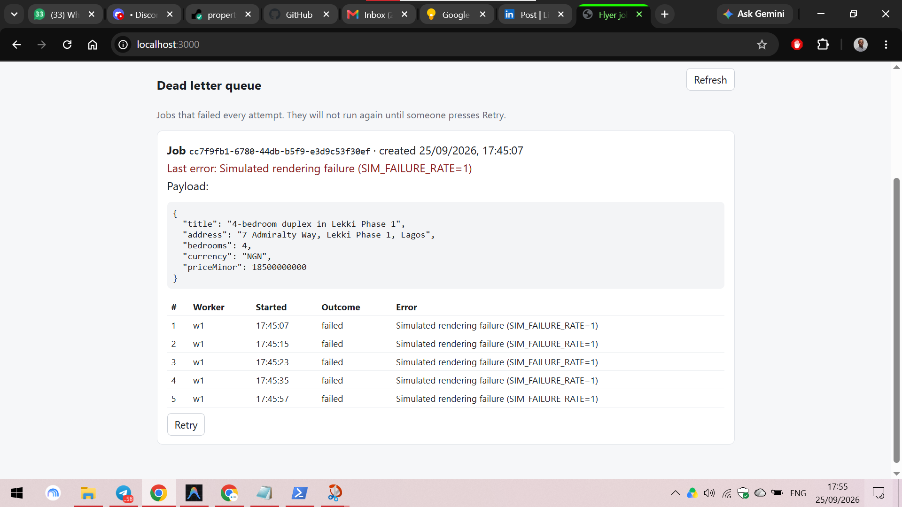
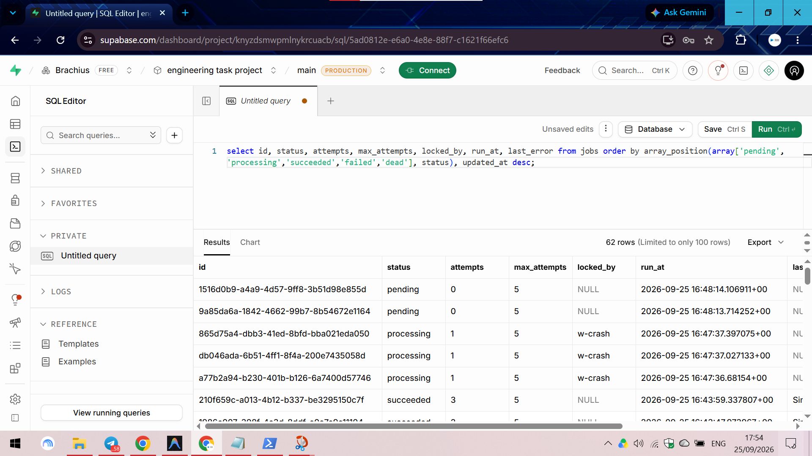
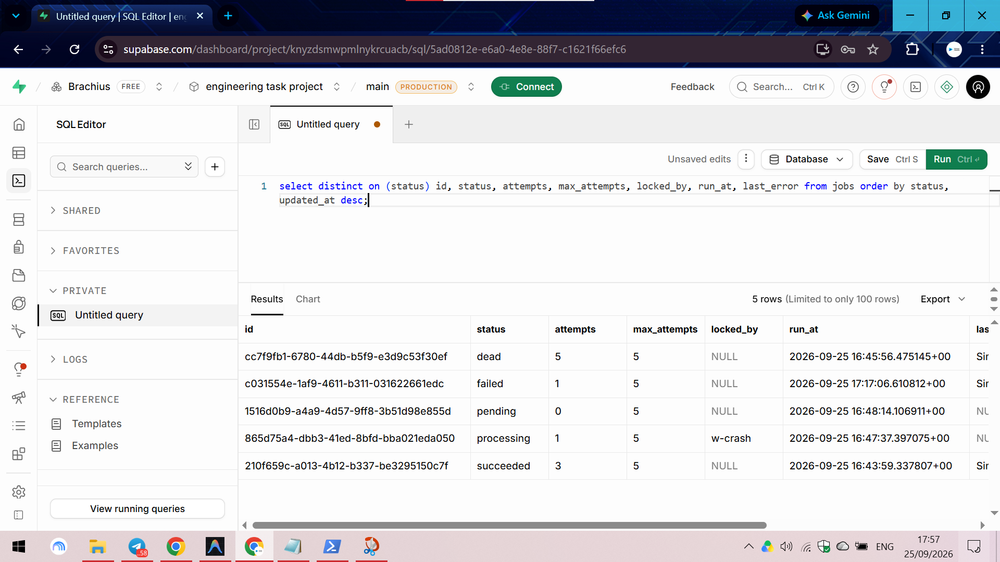

# Background Jobs: Listing Flyers

A job system that turns a property listing into a one-page PDF flyer in the background.

A client asks for a flyer. The API writes a job row and answers **immediately** with `202` and a
job id. A separate **worker** process picks the job up, makes the PDF, and records what happened.
If the work fails, the job is retried later, waiting longer each time. After 5 failed attempts it
is marked `dead` and waits for a person to look at it. Every attempt is recorded, so there is
always an answer to "what happened to this job?"

**What this is not:** there is no login, no landing page, and no interface beyond one small page
to create a job, watch its status, and see dead jobs with a Retry button.

**About the "slow and unreliable" part.** Making a small PDF really takes a fraction of a second and
never fails. The brief needs work that is slow or unreliable, or the retry and crash tests have
nothing to catch. So the worker waits 2 to 4 seconds before rendering, and fails 20% of attempts
on purpose. Both numbers are in [`src/config.ts`](src/config.ts), and the tests change them
(for example, 100% failure) through environment variables. Everything else, including the
database, retries, and crash recovery, is real.

## Contents

1. [How to run it](#how-to-run-it)
2. [The job record](#the-job-record)
3. [How each requirement is met](#how-each-requirement-is-met)
4. [Break it on purpose: the five tests](#break-it-on-purpose-the-five-tests)
5. [API](#api)
6. [Design decisions](#design-decisions)
7. [What this does not handle](#what-this-does-not-handle)

---

## How to run it

Requirements: Node.js 20 or newer and a Postgres 13+ database (a free Supabase project works).

1. Install:
   ```bash
   git clone <this repo>
   cd engineering-task-2-background-jobs
   npm install
   ```
2. Create `.env` from the example and set `DATABASE_URL`:
   ```bash
   cp .env.example .env
   ```
   In Supabase: open the project → **Connect** → **Session pooler** (port 5432). Put your database
   password in place of `[YOUR-PASSWORD]`, removing the brackets. If the password contains `@`,
   write it as `%40`.
3. Create the tables (safe to run twice):
   ```bash
   npm run migrate
   ```
4. Start the API and web page, in one terminal:
   ```bash
   npm run api
   ```
   Open http://localhost:3000.
5. Start a worker, in a second terminal:
   ```bash
   npm run worker
   ```
   To see the queue shared safely, start more workers in more terminals.
6. Make a flyer from the web page, or with curl:
   ```bash
   curl -i -X POST http://localhost:3000/api/jobs \
     -H "Content-Type: application/json" \
     -H "Idempotency-Key: my-first-flyer" \
     -d '{"type":"listing_flyer","payload":{"title":"3-bedroom apartment in Yaba","priceMinor":270000000,"currency":"NGN","address":"12 Herbert Macaulay Way, Yaba, Lagos","bedrooms":3}}'
   ```

Other commands:

| Command                                   | What it does                                                          |
| ----------------------------------------- | --------------------------------------------------------------------- |
| `npm run burst -- 50`                     | sends 50 jobs at once (the API must be running)                       |
| `npm run report`                          | counts jobs by status and lists the latest ones                       |
| `npm run report -- timeline <job id>`     | every attempt of one job, with the wait before each                   |
| `npm run report -- concurrency <prefix>`  | peak jobs-at-once per worker, and checks for double claims            |
| `npm run test:idempotency`                | runs the same job's work twice and counts the flyers                  |
| `npm run typecheck`                       | TypeScript check                                                      |

Any setting in [`src/config.ts`](src/config.ts) can be changed for one run with an environment
variable. For example, in PowerShell: `$env:SIM_FAILURE_RATE='1'; npm run worker` makes every
attempt fail.

---

## The job record

Every job is one row in `jobs` ([`sql/001_jobs.sql`](sql/001_jobs.sql)).

| Column            | Type        | Meaning                                                              |
| ----------------- | ----------- | -------------------------------------------------------------------- |
| `id`              | uuid        | generated by the database                                            |
| `type`            | text        | what kind of work: `listing_flyer`                                   |
| `payload`         | jsonb       | the input: the listing's title, price, address, bedrooms             |
| `status`          | text        | `pending`, `processing`, `succeeded`, `failed`, or `dead`            |
| `attempts`        | integer     | how many times a worker has started this job                         |
| `max_attempts`    | integer     | copied from configuration when the job is created                    |
| `last_error`      | text        | the most recent error message, or null                               |
| `run_at`          | timestamptz | the earliest time a worker may pick the job up                       |
| `started_at`      | timestamptz | when the current or latest attempt started                           |
| `finished_at`     | timestamptz | when the job reached `succeeded` or `dead`                           |
| `locked_by`       | text        | which worker is running it right now, or null                        |
| `idempotency_key` | text        | **unique**: the same key twice gives back the same job               |

Two more tables:

- **`job_attempts`**: one row per attempt, recording which worker ran it, when, and how it ended
  (`succeeded`, `failed`, or `abandoned`). `unique (job_id, attempt)` means attempt number N of a
  job can only ever be recorded once. This is the history the dead letter view shows.
- **`flyers`**: the output. `job_id` is its primary key, so one job can never have two flyers.

### The status lifecycle

```
                  claimed by a worker
   pending ─────────────────────────────▶ processing ──── work finished ────▶ succeeded
      ▲                                    │   │
      │ stuck too long (worker died)       │   │ work threw an error
      └────────────────────────────────────┘   ▼
                                     attempts left?
                                       yes │        no
                                           ▼         ▼
            failed ── run_at reached ──▶ (claimed again)     dead ── human clicks Retry ──▶ pending
```

- **pending**: waiting for a worker; never tried, or put back after a worker died mid-job.
- **processing**: a worker is running it right now.
- **succeeded**: done; the flyer exists.
- **failed**: an attempt failed, **and it will be retried** at `run_at`.
- **dead**: every attempt failed. **It will not be retried** until a person presses Retry.

`failed` means "the system is still handling this". `dead` means "the system has given up, and a
human needs to look". Mixing them up either retries forever or hides problems nobody sees.

The database itself refuses some impossible combinations:

- `attempts` can never exceed `max_attempts`.
- A `processing` job must have `locked_by` and `started_at`.
- A `failed` or `dead` job must have a `last_error`.

---

## How each requirement is met

| Requirement                                   | Where                                                                                        |
| --------------------------------------------- | -------------------------------------------------------------------------------------------- |
| Job table with full lifecycle including dead  | [`sql/001_jobs.sql`](sql/001_jobs.sql)                                                        |
| Enqueue returns 202 immediately               | `POST /api/jobs` in [`src/app.ts`](src/app.ts), `enqueueJob` in [`src/jobs/queue.ts`](src/jobs/queue.ts) |
| Idempotency key enforced at the database      | `idempotency_key text not null unique` + `on conflict (idempotency_key) do nothing`          |
| Atomic claim                                  | `claimNextJob` in [`src/jobs/queue.ts`](src/jobs/queue.ts)                                    |
| Concurrency cap in configuration              | `worker.concurrency` in [`src/config.ts`](src/config.ts), enforced by `fillFreeSlots` in [`src/worker.ts`](src/worker.ts) |
| Exponential backoff with jitter               | [`src/jobs/backoff.ts`](src/jobs/backoff.ts)                                                  |
| Idempotent work                               | `generateListingFlyer` in [`src/jobs/listingFlyer.ts`](src/jobs/listingFlyer.ts) + `flyers.job_id` primary key |
| Stuck job recovery                            | `sweepStuckJobs` in [`src/jobs/queue.ts`](src/jobs/queue.ts), run by every worker            |
| Dead letter view with manual retry            | [`public/`](public/), `GET /api/jobs?status=dead`, `POST /api/jobs/:id/retry`                 |
| Status endpoint                               | `GET /api/jobs/:id`                                                                          |

### Enqueue: write a row, answer, do nothing else

The handler checks the input, inserts one row, and responds. It never makes the PDF and never
waits for it. A new job gets `202 Accepted` ("taken on, not done yet").

```sql
insert into jobs (type, payload, max_attempts, idempotency_key)
values ($1, $2, $3, $4)
on conflict (idempotency_key) do nothing
returning ...
```

If the key already exists, the insert does nothing. The API then looks the existing job up and
returns it with `200`. The same key with a different body gets `409`, because that is a client bug,
not a retry.

### Claim: one statement, so two workers can never take the same job

```sql
update jobs
   set status = 'processing', attempts = attempts + 1, started_at = now(), locked_by = $1
 where id = (
         select id from jobs
          where status in ('pending', 'failed') and run_at <= now()
          order by run_at
          limit 1
          for update skip locked
       )
   and status in ('pending', 'failed')
returning *
```

The inner `select` finds the oldest ready job and **locks** that row. `skip locked` means another
worker that reaches the same row doesn't wait; it skips to the next free one. The outer `update`
changes the status while the row is still locked. So there is no moment where a job has been
*read* but not yet *taken*. The broken alternative, a `select` followed by a separate `update`,
leaves exactly that gap, and two workers can both read the same pending job in it.

The same statement also inserts the `job_attempts` row, so the claim and its record can't get
separated.

### Concurrency cap

```ts
async function fillFreeSlots() {
  while (running < config.worker.concurrency) {
    const job = await claimNextJob(workerId);
    if (!job) return;
    runJob(job).catch(...);   // not awaited: runs in the background
  }
}
```

The worker only claims a job when it has a free slot, so it never holds more than
`WORKER_CONCURRENCY` jobs at once (default 5).

### Failure: attempts, backoff, dead

Attempts are counted when a job is **claimed**, not when it fails. If a worker dies mid-job, that
attempt still counts. Otherwise a job that crashes its worker every time would retry forever.

When the work throws, `markFailed` stores the error and then:

- attempts left → status `failed`, `run_at` = now + backoff delay
- no attempts left → status `dead`

The delay, from [`src/jobs/backoff.ts`](src/jobs/backoff.ts):

```ts
const exponential = config.retry.baseDelayMs * 2 ** (attempts - 1);
const jitter = Math.random() * config.retry.maxJitterMs;
return Math.round(exponential + jitter);
```

With the defaults (base 2s, jitter up to 1s), the waits are about 2s, 4s, 8s, and 16s, each plus a
random 0 to 1s. The jitter line is the second one. Without it, 100 jobs that failed at the same
moment would all retry at exactly the same moment, and hit whatever was failing all at once again.
In test 1, jobs that failed their first attempt got delays of 2.2s, 2.5s, 2.6s and 3.0s instead of
all exactly 2.0s.

### Idempotent work

A worker can finish the work and crash before marking the job `succeeded`. The job then runs
again. [`generateListingFlyer`](src/jobs/listingFlyer.ts) makes that safe:

1. Before doing anything, it checks whether a flyer for this job id already exists. If so, the
   work is already done, so it returns.
2. It saves the flyer with `on conflict (job_id) do nothing`. If two runs get past step 1 at the
   same time, the primary key lets only one row in.

The job id is the key on the output, so however many times a job runs, it produces one flyer.

### Stuck jobs

Every worker runs `sweepStuckJobs` when it starts, and every 10 seconds after that. Any job still
in `processing` more than `STUCK_JOB_TIMEOUT_MS` (default 60s) after it started is assumed to
belong to a dead worker:

- attempts left → back to `pending`, runnable straight away, with `last_error` saying which worker
  stopped responding
- no attempts left → `dead`

The attempt it was on is marked `abandoned` in `job_attempts`.

So a job can only stay in `processing` for long if **no worker is running at all**. It is then
recovered by the first sweep of the next worker to start, which is what test 3 shows.

The timeout has to be longer than the slowest real job. If it were shorter, the sweep would take a
job away from a worker that is still running it. Two protections cover that case anyway:

- The work is idempotent, so a second run can't make a second flyer.
- The old worker's late result is ignored. `markSucceeded` and `markFailed` only update the row if
  `locked_by` and `attempts` still match the attempt that worker claimed.

---

## Break it on purpose: the five tests

All five were run against the Supabase database. The full output of each is in
[`docs/evidence/`](docs/evidence/).

### 1. 50 jobs at once: does the concurrency cap hold?

`npm run burst -- 50` with one worker, `WORKER_CONCURRENCY=5`.
Full output: [`concurrency-50-jobs.txt`](docs/evidence/concurrency-50-jobs.txt).

From the worker's log, the count never passes 5; a new job starts only when one finishes:

```
16:43:06.539Z [w1] start   ee78803a attempt 1/5  (running 2/5, peak 2)
16:43:06.678Z [w1] start   f67a7c7a attempt 1/5  (running 3/5, peak 3)
16:43:06.980Z [w1] start   e7e896f4 attempt 1/5  (running 4/5, peak 4)
16:43:07.167Z [w1] start   ba1b4d28 attempt 1/5  (running 5/5, peak 5)
16:43:08.114Z [w1] success f7390242
16:43:08.297Z [w1] start   be1d1413 attempt 1/5  (running 5/5, peak 5)
```

Worked out independently from the timestamps in `job_attempts`:

```
worker_id  peak_at_once  attempts_run
w1         5             63
```

All 50 succeeded, after 63 attempts (13 retries from the 20% failure rate), producing 50 flyers.

### 2. 100% failure: watch a job go to dead

Worker started with `SIM_FAILURE_RATE=1`.
Full output: [`backoff-to-dead.txt`](docs/evidence/backoff-to-dead.txt).

```
attempt  started       finished      wait before (s)  outcome
1        16:45:07.665  16:45:11.572                   failed
2        16:45:15.369  16:45:17.873  3.8              failed
3        16:45:23.456  16:45:26.172  5.6              failed
4        16:45:35.733  16:45:39.815  9.6              failed
5        16:45:57.384  16:46:00.073  17.6             failed   → job is now dead
```

The worker chose delays of 2.8s, 4.5s, 8.9s and 16.7s: doubling, plus jitter. The measured waits
are each about a second longer. That second is the worker's 1-second poll interval: a job becomes
ready, and the worker notices on its next check.

The dead job in the dead letter view, with its payload, error, and all five attempts:



### 3. Kill the worker mid-job

A worker with slow jobs (25 to 30 seconds each) started 3 jobs, and its process was force-killed
(`Stop-Process -Force`) while they were running.
Full output: [`stuck-job-recovery.txt`](docs/evidence/stuck-job-recovery.txt).

**Before the kill:** all three in `processing`, owned by `w-crash`.

```
id        status      attempts  locked_by  started_at
a77b2a94  processing  1         w-crash    16:47:37
db046ada  processing  1         w-crash    16:47:38
865d75a4  processing  1         w-crash    16:47:38
```

**After the kill:** nothing changes. The rows still say `processing`, owned by a worker that no
longer exists. Without a sweep they would stay like this forever.



**After restarting a worker:** its first sweep finds them and puts them back. Then it runs them:

```
16:58:23.303Z [w-restarted] worker started: ... stuck timeout 60s
16:58:24.392Z [w-restarted] swept   a77b2a94 was stuck (worker w-crash), now pending
16:58:24.393Z [w-restarted] swept   db046ada was stuck (worker w-crash), now pending
16:58:24.393Z [w-restarted] swept   865d75a4 was stuck (worker w-crash), now pending
16:58:25.485Z [w-restarted] start   a77b2a94 attempt 2/5  (running 3/5, peak 3)
...
16:58:29.147Z [w-restarted] success a77b2a94
```

```
job       attempt  worker_id    started   finished  outcome
a77b2a94  1        w-crash      16:47:37  16:58:24  abandoned
a77b2a94  2        w-restarted  16:58:25  16:58:29  succeeded
```

### 4. The same idempotency key twice

Full output: [`idempotency-key.txt`](docs/evidence/idempotency-key.txt).

```
One after the other:
  first:  { status: 202, id: '0478f606-...' }
  second: { status: 200, id: '0478f606-...' }
Both at the same moment:
  request A: { status: 202, id: '4fa41b91-...' }
  request B: { status: 200, id: '4fa41b91-...' }

Rows in the jobs table per key:
  double-submit-1790354554059            1
  double-submit-parallel-1790354555914   1
```

The second case is the important one. Both requests arrived together, so neither could have
seen the other's job with a check in code. The unique constraint on `idempotency_key` is what
stopped the second insert.

### 5. Two workers against the same queue

Workers `w1` and `w2` running at the same time, 50 jobs sent at once.
Full output: [`two-workers.txt`](docs/evidence/two-workers.txt).

```
worker_id  peak_at_once  attempts_run
w1         5             31
w2         5             32

Jobs worked on by two workers at the same time: 0
Jobs that succeeded more than once:             0
Flyers produced:                                50
```

"Worked on by two workers at the same time" compares every pair of attempts of the same job and
counts pairs whose running times overlap. It was 0. The workers did share retries, though: a job
could fail on one worker and succeed on the other, one after the other:

```
0a5c78a7   1:w1:failed  ->  2:w2:succeeded
26e068e6   1:w2:failed  ->  2:w1:failed  ->  3:w1:succeeded
```

### Extra: the work itself run twice produces one output

`npm run test:idempotency` runs the flyer work twice for the same job, first one after the other
(the "crashed before marking succeeded" case), then both at the same moment (the "sweep handed
it to a second worker" case).
Output: [`idempotent-work.txt`](docs/evidence/idempotent-work.txt).

```
Case 1, one after the other.
  after run 1: 1 flyer(s)
  after run 2: 1 flyer(s)
Case 2, two runs at the same moment.
  after both runs: 1 flyer(s)
```

### The jobs table with every status



To get all five at once, the worker was stopped while jobs were in different states. The
`processing` row is one of the jobs from test 3, whose worker had been killed. The `failed` job had
been given a 30-minute backoff so it would stay `failed` long enough to screenshot. Text version:
[`every-status.txt`](docs/evidence/every-status.txt).

---

## API

All responses are `{ "data": ... }` or `{ "error": { "code", "message", "details"? } }`.

| Method | Path                       | What it does                                                                  |
| ------ | -------------------------- | ----------------------------------------------------------------------------- |
| POST   | `/api/jobs`                | create a job. Needs an `Idempotency-Key` header. `202` new, `200` repeat      |
| GET    | `/api/jobs/:id`            | status, attempts, last error, next attempt time, and `resultUrl` when done    |
| GET    | `/api/jobs?status=dead`    | list jobs by status (up to 100); this is the dead letter view's data         |
| GET    | `/api/jobs/:id/attempts`   | every attempt: worker, start, finish, outcome, error                          |
| POST   | `/api/jobs/:id/retry`      | retry a dead job. `409` if the job is not dead                                |
| GET    | `/api/jobs/:id/flyer`      | the PDF, once the job has succeeded                                           |

`POST /api/jobs` body:

```json
{
  "type": "listing_flyer",
  "payload": {
    "title": "3-bedroom apartment in Yaba",
    "priceMinor": 270000000,
    "currency": "NGN",
    "address": "12 Herbert Macaulay Way, Yaba, Lagos",
    "bedrooms": 3
  }
}
```

`priceMinor` is in kobo (₦2,700,000 = 270000000). Errors:

- `400`: no `Idempotency-Key`, or the body isn't valid JSON
- `409`: the key was already used with a different body
- `422`: invalid payload, with each field named

`GET /api/jobs/:id` while a job waits to retry:

```json
{
  "data": {
    "id": "c031554e-1af9-4611-b311-031622661edc",
    "type": "listing_flyer",
    "status": "failed",
    "attempts": 1,
    "maxAttempts": 5,
    "lastError": "Simulated rendering failure (SIM_FAILURE_RATE=1)",
    "nextAttemptAt": "2026-09-25T17:17:06.610Z",
    "resultUrl": null,
    "...": "..."
  }
}
```

---

## Design decisions

**`failed` means "waiting to retry", not "back to pending".** The brief's step 4 says to set a
failed job back to `pending`. I kept it as `failed` until its retry time comes. Both statuses can
be picked up by a worker, but the table then tells you which jobs have never been tried (`pending`)
and which are recovering from a failure (`failed`). A job that was stuck because its worker died
does go back to `pending`, as the brief says. Its attempt still counts, and `last_error` records
what happened.

**A stuck job retries immediately, a failed one waits.** A failed attempt means the work, or
something it depends on, went wrong, so it's worth waiting before trying again. A stuck job means
the *worker* died, so another worker can try right away.

**Manual retry adds attempts rather than resetting them.** Retrying a dead job raises
`max_attempts` by 5 instead of setting `attempts` back to 0. Attempt numbers in the history keep
counting up (6, 7, 8…), so the record of the first five failures is kept, and
`unique (job_id, attempt)` still holds.

**Postgres as the queue, not Redis or a queue service.** The job table is the queue. `for update
skip locked` gives safe claiming across any number of workers, and the job, its history, and its
output all live in one database, so the idempotency constraints can span them. A dedicated queue
would add another system to run, for a load this small.

**Why the database, not code, enforces the rules.** Idempotency keys, one-flyer-per-job, and
attempt numbering are all unique constraints. A check in code ("does this key exist? if not,
insert") has a gap between the check and the insert. Test 4 sent two requests into that gap on
purpose, and only the constraint caught it.

---

## What this does not handle

- **Slow jobs longer than the stuck timeout.** A job that genuinely takes longer than 60 seconds
  would be swept while still running. The work is idempotent and the late result is ignored, so
  nothing breaks, but the work is done twice. A real system would have the worker update a
  heartbeat column while it works, and sweep on the heartbeat instead of `started_at`.
- **Permanent errors are retried like temporary ones.** An error that will never go away is
  retried 5 times before going dead. Separating "retryable" from "give up now" errors would send
  those straight to `dead`.
- **Graceful shutdown.** Stopping a worker with Ctrl+C leaves its jobs in `processing` until the
  sweep recovers them. A kinder shutdown would stop claiming and finish the current jobs first.
- **The job list isn't paginated.** `GET /api/jobs` returns up to 100. Fine for a dead letter
  queue; not for browsing thousands of jobs.
- **No authentication.** Outside the brief. Anyone who can reach the API can create jobs and
  retry dead ones.
